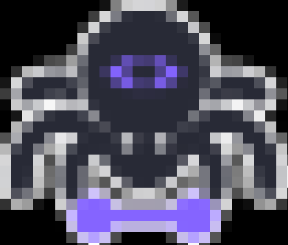
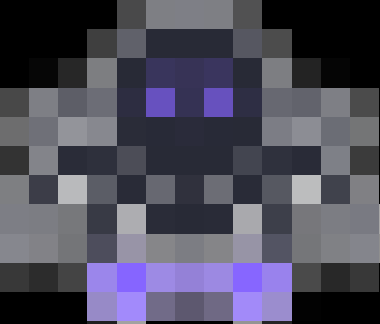
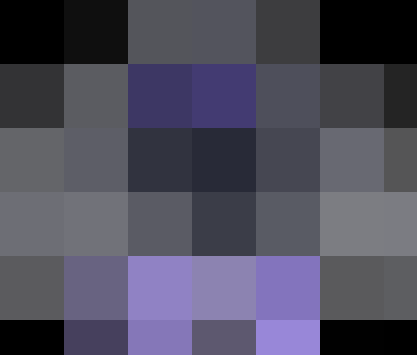

# 👾 pixel8bit

[](https://crates.io/crates/pixel8bit)
[](https://opensource.org/licenses/MIT)
[](https://github.com/PeriniM/pixel8bit/actions)
[](https://crates.io/crates/pixel8bit)

**pixel8bit** is a Rust library and command-line tool that applies 8-bit pixelation effects to images, with optional symmetry detection and mirroring.

## ✨ Features

- 8-bit Pixelation: Transform images to emulate classic 8-bit graphics.
- Symmetry Detection: Automatically detect horizontal and vertical symmetry axes.
- Mirroring: Mirror images around detected symmetry axes for artistic effects.

## 📦 Installation

To install **pixel8bit**, ensure you have [Rust and Cargo](https://www.rust-lang.org/tools/install) installed. Then, run:

```
cargo install pixel8bit
```

## 🚀 Usage

After installation, you can use the pixel8bit command-line tool as follows:

```
pixel8bit <input_path> <output_path> <block_size> <is_mirrored>
```

- <input_path>: Path to the input image file.
- <output_path>: Path to save the processed image.
- <block_size>: Size of the pixel blocks (e.g., 16).
- <is_mirrored>: true or false to enable or disable mirroring.

Example:

To pixelate an image with a block size of 16 pixels and enable mirroring:

```
pixel8bit input.jpg output.jpg 16 true
```

## 🛠️ Library Integration

To use **pixel8bit** as a library in your Rust project, add the following to your Cargo.toml:

[dependencies]
pixel8bit = "0.1.0"

Then, in your code:

```rust
use pixel8bit::pixelate::apply_pixelation;
use pixel8bit::symmetry::{detect_symmetry, mirror_image};
```

## 🖼️ Pixelation Examples


| Block Size | Result |
|------------|---------|
| Original |  |
| 8x8 |  |
| 16x16 |  |
| 32x32 |  |
| 64x64 |  |


## 🤝 Contributing

Contributions are welcome! Please fork the repository and submit a pull request.

## 📄 License

This project is licensed under the MIT License.
